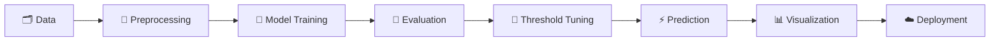

<div align="center">

# 🧠 ChurnAI

### 📉 Customer Churn Prediction System 📈

**An end-to-end Machine Learning application that predicts telecom customer churn risk and converts model predictions into actionable business insights.**

<p>
  <a href="https://customer-churn-prediction-as.streamlit.app/">
    
  </a>
</p>

<p>
  <a href="https://www.python.org/"></a>
  <a href="https://scikit-learn.org/"></a>
  <a href="https://streamlit.io/"></a>
  
  
</p>

<p>
  
  
  
</p>

</div>

---

## ✨ Overview

**ChurnAI** is a deployed telecom customer churn prediction system built using Python and Scikit-learn.

It takes customer demographic, service, contract, and billing information, predicts the **probability of churn**, and converts that probability into a business-friendly risk classification.

> 🎯 **Goal:** Identify customers who may be at risk of leaving so that retention efforts can be focused where they matter.

---

## 🚀 Live Demo

<div align="center">

### 👉 [**Open ChurnAI: Live Application**](https://customer-churn-prediction-as.streamlit.app/) 👈

</div>

---

## 🔥 Key Features

| | Feature | Description |
|:-:|---|---|
| 🎛️ | **Interactive UI** | Enter customer information through a Streamlit interface |
| 🤖 | **ML Prediction** | Predicts the probability that a customer will churn |
| 📊 | **Risk Analysis** | Converts probability into a churn-risk classification |
| 🎯 | **Decision Threshold** | Uses a tuned threshold instead of blindly relying on 0.50 |
| 📈 | **Visual Results** | Displays prediction results through charts and metrics |
| 💼 | **Business Insight** | Explains what the prediction means from a retention perspective |
| ☁️ | **Cloud Deployment** | Deployed using Streamlit Community Cloud |

---

## 🛠️ Tech Stack

| Category | Technologies |
|---|---|
| 🐍 **Language** | Python |
| 🧹 **Data Processing** | Pandas, NumPy |
| 🤖 **Machine Learning** | Scikit-learn |
| 📊 **Visualization** | Matplotlib, Seaborn |
| 🌐 **Web Application** | Streamlit |
| 💾 **Model Persistence** | Joblib |
| ☁️ **Deployment** | Streamlit Community Cloud |
| 🔗 **Version Control** | Git, GitHub |

---

## 📌 Model Development

Multiple classification models were compared:

- 📏 Logistic Regression
- 🌳 Decision Tree
- 🌲 Random Forest

> 🏆 **Logistic Regression** was optimized using **GridSearchCV**.

### 📊 Model Performance

<div align="center">

| Metric | Result |
|---|---:|
| 📈 ROC-AUC | **0.8409** |
| 🎯 Churn Recall @ 0.30 Threshold | **75.4%** |
| ✅ Accuracy @ 0.30 Threshold | **74.95%** |
| ⚖️ Default Accuracy @ 0.50 | **79.99%** |

</div>

### 🎯 Decision Threshold

The project uses a tuned threshold of **0.30**.

```text
🟢 Probability < 0.30  →  Likely to Stay
🔴 Probability ≥ 0.30  →  Potential Churner
```

The lower threshold prioritizes identifying more potential churners, with the tradeoff of additional false positives.

---

## 💡 Why This Project?

Customer churn directly affects business revenue.

ChurnAI demonstrates how machine learning can be used to:

- 🔎 Identify customers with higher churn risk
- 🎯 Prioritize retention efforts
- 📊 Analyze customer risk
- ⚡ Generate real-time predictions
- 💼 Convert ML output into business-oriented decisions

### 🔄 Complete Pipeline



---

## 🌐 Deployment

The application is deployed using **Streamlit Community Cloud** and connected to GitHub.

<div align="center">

### 🔗 [🚀 **Launch ChurnAI**](https://customer-churn-prediction-as.streamlit.app/)

</div>

---

## 👩‍💻 Project Highlights

<div align="center">

`Machine Learning` `Classification` `Feature Engineering` `Model Comparison` `Hyperparameter Tuning` `ROC-AUC` `Recall` `Threshold Optimization` `Data Visualization` `Streamlit` `Model Deployment` `GitHub`

</div>

---

<div align="center">

## ⭐ ChurnAI

### 🔮 Predict. Analyze. Retain.

<a href="https://customer-churn-prediction-as.streamlit.app/">
  
</a>

</div>
